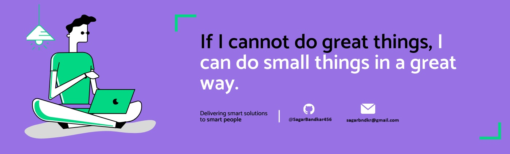

<h1 align="center">Hello I'm Sagar Bandkar</h1>

  
  

  

## 👨🏻‍💻 About Me:

- 🙋‍♂️ All about me is Full stack developer (.Net core + Angular )

- 🔭 I’m currently working on `Something Intresting`.

- 🌱 I’m currently learning `Azure devops`

- 👯 I’m looking to collaborate for `Dev Projects`

- 👨‍💻 Life Hack: Learn new tech :fire: and share what you have learned :tada:

## 🛠️ Technologies and Tools I use:

## ❤️ Let's get connected:

 

